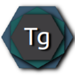
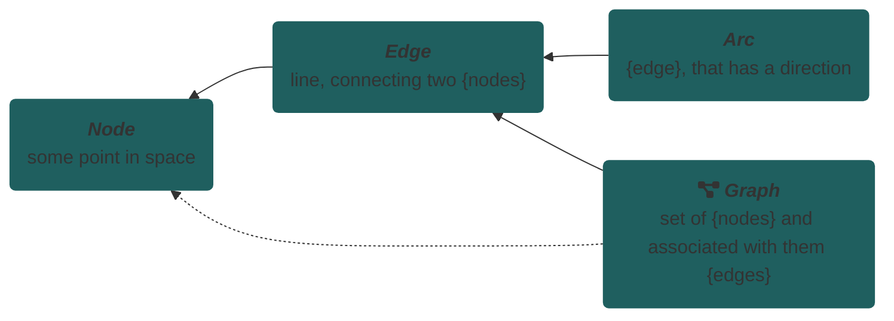

<div align="center">
    <a href="https://savenkovigor.github.io/TermGraph/"></a>
    <h1>TermGraph</h1>
</div>

> [!NOTE]
> This project is primarily a playground for experimenting with new C++ technologies and approaches, so some parts of the codebase may remain a little rough around the edges.

<div align="center">

[](https://isocpp.org/)
[](https://www.qt.io/)
[](https://cmake.org/)
[](https://conan.io/)
&nbsp;&nbsp;&nbsp;&nbsp;&nbsp;
[]()
[](https://emscripten.org/index.html)

</div>

<div align="center">

[Description](#%EF%B8%8F-description) • [Key features](#-key-features) • [SetUp](#-setup) • [Roadmap](#-roadmap) •
[Tech stack](#-tech-stack)

[Build](#hammer_and_wrench-build) • [Tests](#alembic-tests) • [Project structure](#microscope-project-structure) • [Credits](#pushpin-credits)

</div>

# ⚡️ Description

TermGraph is a terms diagram builder. It helps to make a hierarchical projection of a terms-space onto 2d plane and build a map of definitions.
Like this, but bigger:


```mermaid
graph RL
classDef stdN fill:#1f5f5f,stroke-width:0px;
Node("<b><i>Node</i></b></br>some point in space"):::stdN
Edge("<b><i>Edge</i></b></br>line, connecting two {nodes}"):::stdN
Arc("<b><i>Arc</i></b></br>{edge}, that has a direction"):::stdN
Graph("fa:fa-diagram-project <b><i>Graph</i></b></br>set of {nodes} and associated with them {edges}"):::stdN

Edge --> Node
Arc --> Edge
Graph -.-> Node
Graph --> Edge
```

## What for?

**Short answer:** This will help you learn something new faster and with deep understanding.

**Long answer:**
In all well-structured areas of knowledge, it is easy to see how explanations are built up on each other.

The most basic concepts are easily accessible to any beginner. More complex concepts require more effort and are always explained in terms of simpler ones.

If you try to draw the first few "layers" of these terms, it will look like a ladder or lasagna) If you draw them all, you will get a knowledge area map, which can be very useful.

### Benefits for beginners (if you don't have the map yet)

- Its construction guarantees learning with active memorization
- Wikipedia wandering can become a good teacher with this approach (I have checked)

### Benefits for beginners (if you already have such map)

- Understanding what to learn and in what order
- Easier to google something
- If you forgot the term, but remember it's connections - you can easily find it
- You see the "big picture" of knowledge

### Benefits for the experienced

- Blind spots of your knowledge become visible
- Fights the illusion of knowledge
- The learning curve gets higher

### Benefits for experts

- Assistance in the transfer of experience
- Understanding how your expertise relates to other areas of knowledge

## 🌿 Key features

- Builds on Desktop and Wasm
- Supports big maps (at least 1500 nodes)
- Devices synchronization
- Semi-automatic links markup

# 🚀 SetUp

- Desktop: build from sources on ubuntu (yet)
- Wasm: build from sources or available [here](https://termgraph.app)

## 🗺 Roadmap

- [x] Make "hard/quick links" with uuid
- [ ] [Fully automatic link search](https://github.com/SavenkovIgor/TermGraph/issues/5)
- [ ] [Map layers](https://github.com/SavenkovIgor/TermGraph/issues/6)

## 🧬 Tech stack

-  C++ 23
-  Qt 6.8.3 | QML
-  CMake 4.0+ (via Conan)
-  Conan 2
- 🔧 Clang 20
- 🔧 Ninja (via Conan)
- 🌐 [Emscripten](https://emscripten.org/) 3.1.56 (WASM builds)
- 🧪 [GTest](https://github.com/google/googletest) 1.17.0 (desktop tests)
- 📚 [OleanderStemmingLibrary](https://github.com/Blake-Madden/OleanderStemmingLibrary) (git submodule)

# :hammer_and_wrench: Build

[](https://github.com/SavenkovIgor/TermGraph/actions/workflows/ci.yml)

## Requirements for Ubuntu-hosted build

- [Clang](https://clang.llvm.org/) 20
- [Conan](https://docs.conan.io/2/) 2
- [Qt](https://www.qt.io/download-qt-installer) 6.8.3 (with Qml modules)
- [Emscripten](https://emscripten.org/) 3.1.56 (for WASM builds only)

CMake and Ninja are provided automatically via Conan `tool_requires`.

You can build project with QtCreator, using CMake Presets (which QtCreator more or less understands).

Also you can build it with python script at repository root.

Try `./project.py --deps-install --build --run`, it would build and run desktop version

## :alembic: Tests

Tests working only with desktop target. GTest library installed via conan, only for desktop target.

You can start tests from:

- QtCreator **or**
- run `ctest ./` in build folder at `build/desktop_(dev|release)` **or**
- run `./project.py --test` at repository root

## :microscope: Project structure

```bash
├── .github/workflows/       # GitHub actions (CI)
├── conanfiles/              # Conan profiles (host/build/base)
├── data/                    # Static data (JSON knowledge graphs)
├── resources/               # Resources: app icons, main html wrapper etc...
├── source/                  # Main source code
│   ├── Atoms/               # QML atoms components     (atomic design)
│   ├── CommonTools/         # Some common tools with wide reuse
│   ├── enums/               # Enum definitions
│   ├── graph/               # Graph theory primitives
│   ├── helpers/             # Helper utilities (links, stemming, settings)
│   ├── managers/            # Business logic managers
│   ├── model/               # Qt models for graph data
│   ├── Molecules/           # QML molecules components (atomic design)
│   ├── Pages/               # QML pages
│   ├── staticDataStorage/   # Static data storage class
│   ├── TermDataConnection/  # Abstracts the data interface connection
│   ├── TermDataInterface/   # Data storage interface
│   ├── TermDataStorage/     # Data storage
│   ├── Text/                # Text processing
│   ├── Theme/               # QML theme. Colors, icons, fonts etc...
│   └── Tools/               # Some QML debugging tools
├── test/                    # Tests (GTest, desktop only)
├── third_party/             # Git submodules (stemming library)
├── tools/                   # Side utilities
├── CMakeLists.txt           # Main CMake file
├── CMakePresets.json        # CMake presets
├── conanfile.py             # Conan dependencies
└── project.py               # Python script for building and running project
```

## :pushpin: Credits

[](https://www.linkedin.com/in/savenkovigor-dev/)

[](https://github.com/SavenkovIgor/TermGraph)
