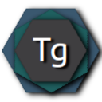

<!-- TODO:
8 Screenshots
- Make them svg
- Add screenshots

9 Badges
- https://forthebadge.com/
- Code quality
- Code coverage

11 Recomendations
- Contribution guideline
- Meetup speech
- Make fixes to my personal profile page on github

14 How to Use? Maybe wiki?
18 Support
- GitHub?
- Patreon?
- Other?

20 Info
- Talk to every community individually
- Try to be in Trending section, but topics is also ok
-->

<div align="center">
    <a href="https://savenkovigor.github.io/TermGraph/"></a>
    <h1>TermGraph</h1>
</div>

<div align="center">

[](https://isocpp.org/)
[](https://www.qt.io/)
[](https://cmake.org/)
[](https://conan.io/)
&nbsp;&nbsp;&nbsp;&nbsp;&nbsp;
[]()
[](https://play.google.com/store/apps/details?id=app.termgraph&pcampaignid=pcampaignidMKT-Other-global-all-co-prtnr-py-PartBadge-Mar2515-1)
[](https://emscripten.org/index.html)

</div>

<div align="center">

[Description](#%EF%B8%8F-description) • [Key features](#-key-features) • [Installation](#-installation) • [Roadmap](#-roadmap) •
[Tech stack](#-tech-stack)<br>
[Build](#hammer_and_wrench-build) • [Tests](#alembic-tests) • [Project structure](#microscope-project-structure) • [Credits](#pushpin-credits)

</div>

# ⚡️ Description
TermGraph is a terms diagram builder. It helps to make a hierarchical projection of a terms-space onto 2d plane and build a map of definitions.
Like this, but bigger:


## What for?
**Short answer:** This will help you learn something new faster and with deep understanding.

**Long anser:**
In all well-structured areas of knowledge, it is easy to see how explanations are built up on each other. <br>
The most basic concepts are easily accessible to any beginner. More complex concepts require more effort and are always explained in terms of simpler ones.

If you try to draw the first few "layers" of these terms, it will look like a ladder or lasagna) If you draw them all, you will get a knowledge area map, which can be very useful.


### Benefits for beginners (if you don't have the map yet)
- Its construction guarantees learning with active memorization
- Wikipedia wandering can become a good teacher with this approach (I have checked)


### Benefits for beginners (if you already have such map):
- Understanding what to learn and in what order
- Easier to google something
- If you forgot the term, but remember it's connections - you can easily find it
- You see the "big picture" of knowledge


### Benefits for the experienced:
- Blind spots of your knowledge become visible
- Fights the illusion of knowledge
- The learning curve gets higher


### Benefits for experts:
- Assistance in the transfer of experience
- Understanding how your expertise relates to other areas of knowledge


## 🌿 Key features
- Builds on Desktop, Wasm and Android
- Supports big maps (at least 1500 nodes)
- Devices synchronization
- Semi-automatic links markup


# 🚀 Installation
<a href='https://play.google.com/store/apps/details?id=app.termgraph&pcampaignid=pcampaignidMKT-Other-global-all-co-prtnr-py-PartBadge-Mar2515-1'></a>
- Desktop: build from sources on ubuntu (yet)
- Wasm: build from sources or available [here](https://termgraph.app)


## 🗺 Roadmap
- [x] Make "hard/quick links" with uuid
- [ ] [Fully automatic link search](https://github.com/SavenkovIgor/TermGraph/issues/5)
- [ ] [Map layers](https://github.com/SavenkovIgor/TermGraph/issues/6)


## 🧬 Tech stack
-  C++ 20
-  Qt 6.4 | Qml
-  Cmake 3.22+
-  Conan 1.59.0
- [GTest lib](https://github.com/google/googletest) (tests)
- [Outcome lib](https://github.com/ned14/outcome) (would be replaced with std::expected when available)
- [coi-serviceworker library](https://github.com/gzuidhof/coi-serviceworker) (sets proper [CORS](https://developer.mozilla.org/ru/docs/Web/HTTP/CORS) headers, for wasm build)


# :hammer_and_wrench: Build
[](https://github.com/SavenkovIgor/TermGraph/actions/workflows/AppBuild.yml)

### Requirements for ubuntu hosted build:
- [Conan](https://docs.conan.io/en/latest/installation.html)
- [Cmake](https://cmake.org/) + Ninja
- [Qt + Qml](https://www.qt.io/download-qt-installer)

You can build project with QtCreator, using CMake Presets (which QtCreator more or less understands).<br/>
Also you can build it with python script at repository root. <br/>
Try `./project.py --install --build --run`, it would build and run desktop version

## :alembic: Tests
Tests working only with desktop target. GTest library installed via conan, only for desktop target.<br/>
You can start tests from:
- QtCreator <b>or</b>
- run `ctest ./` in build folder at `build/desktop_(dev|release)` <b>or</b>
- run `./project.py --test` at repository root


## :microscope: Project structure
```bash
├── .github/workflows/       # Github actions
├── android/                 # Android build
├── conanfiles/              # Conan profiles, and generated stuff
├── doc/                     # Documents
├── lib/
│   ├── CommonTools/         # Some common tools for possible reuse
│   ├── Graph/               # Graph header-only library
│   ├── QmlAtoms/            # Qml atoms components     (atomic design)
│   ├── QmlMolecules/        # Qml molecules components (atomic design)
│   ├── QmlPages/            # Qml pages
│   ├── QmlTheme/            # Qml theme. Colors, icons, fonts etc...
│   ├── QmlTools/            # Some qml debugging tools
│   ├── QrcHelpImages/       # Help images resources
│   ├── StaticDataStorage/   # Static data storage library. Qrc with terms info
│   ├── TermDataConnection/  # Library, connecting to REST api server
│   ├── TermDataInterface/   # Interface, describing data connection interface
│   ├── TermDataStorage/     # Data storage sqlite library
│   └── Text                 # Text processing library
├── qml/                     # main.qml file
├── resources/               # Resources: app icons, main html wrapper etc...
├── source/                  # Main source code
├── tests/                   # Tests
├── tools/                   # Some side stuff, need from time to time
├── CMakelists.txt           # Main CMake file
├── CMakePresets.json        # CMake presets
├── conanfile.txt            # Conan dependencies (outcome, gtest)
└── project.py               # Python script for building and running project
```
<br/>

## :pushpin: Credits
[](https://www.linkedin.com/in/savenkovigor-dev/)
<br/>
<br/>
[](https://github.com/SavenkovIgor/TermGraph)
